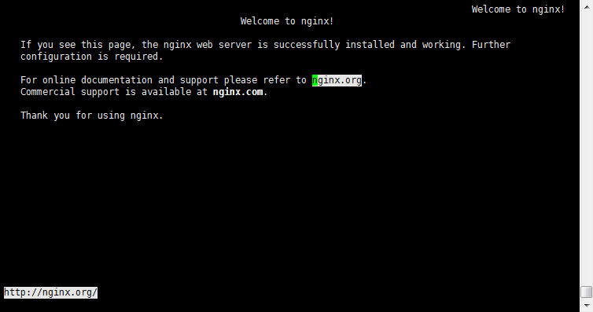
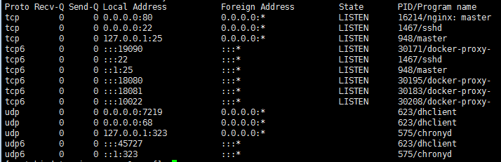
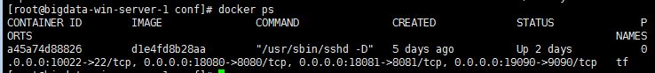

## 一.安装**nginx**
### 1.检查服务器上是否安装好了gcc、g++开发库
``` shell
gcc --version
g++ --version
```
如果没有，则先安装gcc和g++的对应的环境安装包，如服务器系统是centos，则使用以下命令。
``` shell
yum install gcc
yum install gcc gcc-c++
```
### 2.源码编译prce，zlib，openssl，nginx
首先使用==rz==命令将包含prce，zlib，openssl，nginx的[安装压缩包](https://download.csdn.net/download/qq_19875973/10478418)传入到服务器的root/nginx目录，如果没有用==mkdir==新建一个。
pcre,zlib，前者用于url rewrite，后者用于gzip压缩，openssl用于后续可能升级到https时使用。
**pcre安装，执行以下命令**
``` shell
tar -zxvf pcre-8.42.tar.gz
cd pcre-8.42/
./configure&&make&&make install
```
**zlib安装，执行以下命令**
``` shell
tar -zxvf pcre-8.42.tar.gz
cd pcre-8.42/
./configure&&make&&make install
```
**openssl安装，执行以下命令**
注：有的机器上会有openssl，但通常是1.0的版本，源码编译里的是1.1的版本，安装并不冲突。
``` shell
tar -zxvf openssl-1.1.0h.tar.gz
cd openssl-1.1.0h/
./config&&make&&make install
```
**nginx安装，执行以下命令**
注：有的机器上会有openssl，但通常是1.0的版本，源码编译里的是1.1的版本，安装并不冲突。
``` shell
tar -zxvf nginx-1.14.0.tar.gz
cd nginx-1.14.0/
./configure --prefix=/usr/local/nginx --with-http_ssl_module --with-pcre=../pcre-8.42 --with-zlib=../zlib-1.2.11 --with-openssl=../openssl-1.1.0h
make&&make install
```
### 3.测试nginx是否安装成功
``` shell
cd /usr/local/nginx/sbin
./nginx
```
如果出现以下报错，则代表80端口正在被占用。
``` shell
nginx [emerg] bind() to 0.0.0.0:80 failed(98：address already in use)
```
需要进行如下处理
``` shell
ps -e | grep nginx  #查看是否已经启动了nginx
netstat -ltunp     #查看0.0.0.0:80端口谁占用了
kill -9 <targetPID> #关掉对应的进程
```
最后访问服务器的浏览器
``` shell
links http://localhost/  #或者本机的IP地址
```
如果能正常显示nginx首页，则表示安装成功。


## 二.配置**nginx**的准备步骤
>本次应用的目的是拿nginx做服务的负载均衡，而且提供的ner服务已用docker进行部署，因此我们首先需要查看docker映射的端口，然后通过修改upsteam，location，proxy三个模块达到目的，本章主要进行原理性的解说，不感兴趣者可以略过。
### 1.查看docker服务映射的端口
``` shell
netstat -ltunp #查看端口
```

如上图所示，本机的docker服务端口是19090，18080，18081，10022。我们再使用==docker ps==命令查看已经启动的容器情况，得到下图。


在port项中可以看到，本机的19090，18080，18081，10022端口分别被映射到docker容器中的9090，8080，8081，22端口。此时访问本机中的映射端口即可访问容器内 web 应用相应提供的界面。

### 2.定位到nginx的配置文件下
``` shell
cd usr/local/nginx/conf/
```
其中的nginx.conf文件存放着nginx服务器的基础配置，默认的配置。如是新手，可以使用==cat==命令查看一下默认的配置，里面有一些配置的样例注释。而且，新手最好使用==cp==命令将原始配置文件进行备份。
### 3.负载均衡配置基本知识
>upstream 定义负载节点池，location 模块 进行URL匹配，proxy模块 发送请求给upstream定义的节点池。

**upstream模块**
==upstream==块定义了一个上游服务器的集群，便于反向代理中的proxy_pass使用。
nginx默认支持四种调度算法，还有两种可以通过下载扩展包来使用：

 - 轮询(rr),每个请求按时间顺序逐一分配到不同的后端服务器，如果后端服务器故障，故障系统自动清除，使用户访问不受影响。
 - 轮询权值(weight),weight值越大，分配到的访问几率越高，主要用于后端每个服务器性能不均的情况。
 - ip_hash，每个请求按访问IP的hash结果分配，这样来自同一个IP的固定访问一个后端服务器，主要解决动态网站session共享的问题。
 - least_conn 最少链接数，那个机器连接数少就分发。
 - url_hash，按照访问的URL的hash结果来分配请求，是每个URL定向到同一个后端服务器，可以进一步提高后端缓存服务器的效率，nginx本身不支持，如果想使用需要安装nginx的hash软件包。
 - fair，这个算法可以依据页面大小和加载时间长短智能的进行负载均衡，也就是根据后端服务器的响应时间来分配请求，相应时间短的优先分配，默认不支持，如果想使用需要安装upstream_fail模块。
 
==server==配置项指定后端服务器的名字，这个名字可以是域名、IP地址端口，UNIX句柄等，同时还可以设定每个后端服务器在负载均衡调度中的状态。
**location模块**
==location==作用：基于一个指令设置URI。
其基本语法是：
  location ==[=|~|~*|^~|@]== pattern { ... }
  ==[=|~|~*|^~|@]== 被称作 location modifier ，这会定义 Nginx 如何去匹配其后的 pattern ，以及该 pattern 的最基本的属性（简单字符串或正则表达式）
  
 - ==＝== 精确匹配，如果找到匹配=号的内容，立即停止搜索，并立即处理请求(优先级最高)
 -  ==~== 区分大小写
 -  ==~*== 不区分大小写
 -  ==*~== 只匹配字符串，不匹配正则表达式
 -  ==@== 指定一个命名的location，一般用于内部重定义请求
 
**proxy模块**
- ==proxy_pass== 指令，可以将请求转发到另一台服务器。
- ==proxy_set_header== 指令，当后端Web服务器上也配置有多个虚拟主机时，需要用该Header来区分反向代理哪个主机名。
- ==proxy_set_header X-Forwarded-For== 指令，如果后端Web服务器上的程序需要获取用户IP，从该Header头获取。

**log配置**
nginx日志主要分为两种，访问日志==access.log==和错误日志==error.log==。
这两个日志所在的路径一般在==usr/local/nginx==中。
其基本语法为：
==erro/access_log /path/file level==
日志级别为：
==debug < info < notice < warn < error < crit < alert < emerg < stderr==
当传入的level级别小于或者等于log参数中的日志级别，就会输出日志内容，否则这条日志就会被忽略。
nginx日志配置一般使用下面三个参数：
- error/access_log: 定义日志的路径及格式。
- log_format: 定义日志的模板。
- open_log_file_cache: 定义日志文件缓存。
## 三.根据应用要求配置**nginx**
### 1.nginx连接不同机器上的docker上的多端口
>目前在两台服务器上分别布置了NER的docker服务，每个docker提供了两个服务，一个是http://localhost:18080/TextSplit， 访问这个页面可以打开分句服务帮助文档页面，再进一步访问http://localhost:18080/TextSplit/test_sentences_seg.jsp， 可以打开分句测试页面。一个是http://localhost:19090/， 访问这个页面可以获得文本标注服务。于是我们可以用两个upstream块分别代表两个端口的服务，再进行相应的proxy_pass配置。
配置代码如下：

``` nginxconf
	upstream ner_tag_servers{
		server 172.26.9.179:19090 weight=1;
		server 172.26.9.241:19090 weight=1;
	}
	
	upstream ner_Text_split{
		server 172.26.9.179:18080 weight=1;
		server 172.26.9.241:18080 weight=1;
	}
	
	server {
        listen       8080;
        server_name  ner_test;
		
        location / {
            root   html;
            index  index.html index.htm;

        }
		
		#处理tag请求
        location /tag { 
			proxy_pass http://ner_tag_servers/;  #后面的'/'一定要有
        }
		
        #提交tag语句后返回NLP页面
        location /NLP {
			proxy_pass http://ner_tag_servers/NLP;
        }
		
		#处理分句以及其帮助文档请求
	    location /TextSplit {
			proxy_pass http://ner_Text_split/TextSplit;
        }
		
        # 将服务错误页面重定向到静态页面50x.html
        error_page   500 502 503 504  /50x.html;
        location = /50x.html {
            root   html;
        }
    }
```
配置好后，我们通过访问nginx所在的服务器ip对应的地址便可以访问所需的服务，如，目前nginx所在的服务器IP是172.26.9.179，那么访问标注服务的地址如下：
http://172.26.9.179:8080/tag
访问分句文档的地址如下：
http://172.26.9.179:8080/TextSplit/
访问分句服务的地址如下：
http://172.26.9.179:8080/TextSplit/test_sentences_seg.jsp
接下来我们进行日志配置，进行访问IP，上游服务器地址，响应时间等消息的记录，配置如下：

``` nginxconf
	#定义返回日志格式
	log_format  main  '$remote_addr - $remote_user [$time_local] "$request" '
            '$status $body_bytes_sent "$http_referer" '
            '"$http_user_agent" "$http_x_forwarded_for"'
			'"request_time" "$request_time"'
			'"upstream_addr" "$upstream_addr"'
			'"upstream_response_time" "$upstream_response_time"';
	
	access_log  /usr/local/nginx/logs/access.log  main;
	error_log  /usr/local/nginx/logs/error.log;
```
## 四.优化配置**nginx**
### 1.main全局设置
==worker_processes==指定启动多少进程来处理请求，一般情况下设置成CPU的核数，这样每一个worker进程都绑定特定的CPU核心，进程间切换的代价是最小的，如下：
``` nginxconf
worker_processes auto; 
```
==worker_cpu_affinity==在高并发情况下，通过设置将CPU和具体的进程绑定来降低由于多核CPU切换造成的寄存器等现场重建带来的性能损耗，如本机是8核，则设置如下：
``` nginxconf
worker_cpu_affinity 00000001 00000010 00000100 00001000 00010000 00100000 01000000 10000000;
```


