## 10.25
课前准备：
- 编程语言：python3
- IDE：jupyter notebook
- 库：sklearn，pandas，matplotlib

个人建议：安装一个[anaconda3](https://www.anaconda.com/download/)，除了sklearn 可能需要安装，其它要求都自带了，sklearn的安装在conda 终端里使用命令：

``` python
conda install scikit-learn
```

### 分类算法
#### KNN算法
- 核心思想：物理类聚，人以群分
- 是数据挖掘分类技术中最简单的方法之一
- 思路：如果一个样本在特征空间中的k个最相似(即特征空间中最邻近)的样本中的大多数属于某一个类别，则该样本也属于这个类别
- 要素：
	- 距离度量
		- 曼哈顿距离
		- 欧式距离
		- 各个坐标距离最大值
	- K值选择
		- 过小：模型复杂，过拟合
		- 过大：模型简单，欠拟合
	- 决策规则
		- 少数服从多数

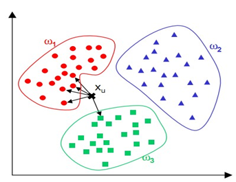

**例子**

``` python
#coding:utf-8

from numpy import *
import operator

##给出训练数据以及对应的类别
def createDataSet():
    group = array([[1.0,2.0],[1.2,0.1],[0.1,1.4],[0.3,3.5]])
    labels = ['A','A','B','B']
    return group,labels

###通过KNN进行分类
def classify(input,dataSe t,label,k):
    dataSize = dataSet.shape[0]
    ####计算欧式距离
    diff = tile(input,(dataSize,1)) - dataSet
    sqdiff = diff ** 2
    squareDist = sum(sqdiff,axis = 1)###行向量分别相加，从而得到新的一个行向量
    dist = squareDist ** 0.5
    
    ##对距离进行排序
    sortedDistIndex = argsort(dist)##argsort()根据元素的值从大到小对元素进行排序，返回下标

    classCount={}
    for i in range(k):
        voteLabel = label[sortedDistIndex[i]] ###对选取的K个样本所属的类别个数进行统计
        classCount[voteLabel] = classCount.get(voteLabel,0) + 1
    ###选取出现的类别次数最多的类别
    maxCount = 0
    for key,value in classCount.items():
        if value > maxCount:
            maxCount = value
            classes = key

    return classes
```
#### 逻辑回归
- 优点：
	- 算法简单，训练速度快
	- 模型鲁棒，工程上稳定性强
- 缺点：
	- 难以处理样本不平衡问题
	- 只能处理线性可分的情形
	- 适用于二分类
#### SVM
- 算法思想：间隔最大的超平面来作为分类边界
- 优点：
	- 有严格数学推理
	- 适合数据量较小的情形
	- 能够处理非线性分类问题
- 缺点：
	-  训练时间长
	-  在处理多分类任务上表现不是很好

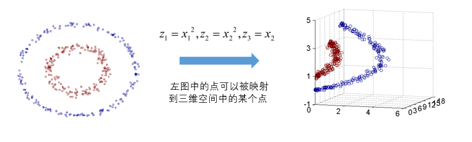


### 回归问题
>连续的预测是回归，离散是分类。如房价预测，收入预测。

#### 线性回归
- 假设特证满足线性关系，根据给定的训练数据训练一个模型，并用此模型进行预测。简单来说就是已知x，求解y。
- 实现：在sklearn里调用sklearn.linear_model.LinearRegression()
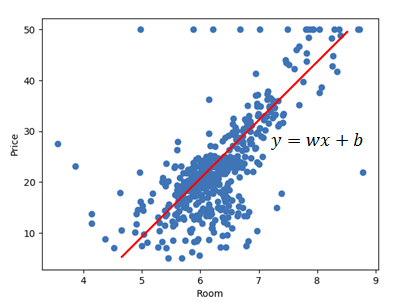

#### 树回归
> 当数据拥有众多特征并且特征之间关系十分复杂时，构建全局模型的想法就显得太难了，也略显笨拙。而且，实际生活中很多问题都是非线性的，不可能使用全局线性模型来拟合任何数据。

- 重要思想：局部回归，将数据集分为多份，每份单独建模
- 主要步骤：递归生成回归树，回归树的剪枝

**例子**
波士顿房价预测

``` python
from sklearn.datasets import load_boston
from sklearn.cross_validation import train_test_split
from sklearn.preprocessing import StandardScaler
from sklearn.tree import DecisionTreeRegressor
from sklearn.metrics import r2_score, mean_squared_error, mean_absolute_error
import numpy as np

# 1 准备数据
# 读取波士顿地区房价信息
boston = load_boston()
# 查看数据描述
# print(boston.DESCR)   # 共506条波士顿地区房价信息，每条13项数值特征描述和目标房价
# 查看数据的差异情况
# print("最大房价：", np.max(boston.target))   # 50
# print("最小房价：",np.min(boston.target))    # 5
# print("平均房价：", np.mean(boston.target))   # 22.532806324110677

x = boston.data
y = boston.target

# 2 分割训练数据和测试数据
# 随机采样25%作为测试 75%作为训练
x_train, x_test, y_train, y_test = train_test_split(x, y, test_size=0.25, random_state=33)


# 3 训练数据和测试数据进行标准化处理
ss_x = StandardScaler()
x_train = ss_x.fit_transform(x_train)
x_test = ss_x.transform(x_test)

ss_y = StandardScaler()
y_train = ss_y.fit_transform(y_train.reshape(-1, 1))
y_test = ss_y.transform(y_test.reshape(-1, 1))

# 4 使用回归树进行训练和预测
# 初始化k近邻回归模型 使用平均回归进行预测
dtr = DecisionTreeRegressor()
# 训练
dtr.fit(x_train, y_train)
# 预测 保存预测结果
dtr_y_predict = dtr.predict(x_test)

# 5 模型评估
print("回归树的默认评估值为：", dtr.score(x_test, y_test))
print("平回归树的R_squared值为：", r2_score(y_test, dtr_y_predict))
print("回归树的均方误差为:", mean_squared_error(ss_y.inverse_transform(y_test),
                                           ss_y.inverse_transform(dtr_y_predict)))
print("回归树的平均绝对误差为:", mean_absolute_error(ss_y.inverse_transform(y_test),
                                               ss_y.inverse_transform(dtr_y_predict)))

'''
回归树的默认评估值为： 0.7066505912533438
平回归树的R_squared值为： 0.7066505912533438
回归树的均方误差为: 22.746692913385836
回归树的平均绝对误差为: 3.08740157480315
'''
```

#### GBRT（渐进梯度回归树）
- 是一个boosting，其算法的核心思想是一堆弱分类器的组合就可以成为一个强分类器，同时不断地在错误中学习，迭代来降低犯错概率。即，每一轮基学习器训练过后都会更新样本权重，再训练下一个学习器，最后将所有的基学习器加权组合。
- Gradient Boosting 在迭代的时候选择梯度下降的方向来保证最后的结果最好。

**例子**
数据还是波士顿房价

``` python
import numpy as np
import matplotlib.pyplot as plt

from sklearn import ensemble  
from sklearn import datasets
from sklearn.utils import shuffle
from sklearn.metrics import mean_squared_error

# 1 准备数据
# 读取波士顿地区房价信息，并对数据进行打乱，分割测试集与训练集
boston = datasets.load_boston()
X, y = shuffle(boston.data, boston.target, random_state=13)
X = X.astype(np.float32)
offset = int(X.shape[0] * 0.9)
X_train, y_train = X[:offset], y[:offset]
X_test, y_test = X[offset:], y[offset:]

# 2.训练回归模型
params = {'n_estimators': 500, 'max_depth': 4, 'min_samples_split': 1,
          'learning_rate': 0.01, 'loss': 'ls'}
clf = ensemble.GradientBoostingRegressor(**params)

clf.fit(X_train, y_train)
mse = mean_squared_error(y_test, clf.predict(X_test))
print("MSE: %.4f" % mse)

# 3.画出训练偏差，计算测试集偏差
test_score = np.zeros((params['n_estimators'],), dtype=np.float64)

for i, y_pred in enumerate(clf.staged_predict(X_test)):
    test_score[i] = clf.loss_(y_test, y_pred)

plt.figure(figsize=(12, 6))
plt.subplot(1, 2, 1)
plt.title('Deviance')
plt.plot(np.arange(params['n_estimators']) + 1, clf.train_score_, 'b-',
         label='Training Set Deviance')
plt.plot(np.arange(params['n_estimators']) + 1, test_score, 'r-',
         label='Test Set Deviance')
plt.legend(loc='upper right')
plt.xlabel('Boosting Iterations')
plt.ylabel('Deviance')

# 画出特征的重要性（ps：这个很好，具有可解释性，不同于神经网络的黑盒）
feature_importance = clf.feature_importances_
feature_importance = 100.0 * (feature_importance / feature_importance.max())
sorted_idx = np.argsort(feature_importance)
pos = np.arange(sorted_idx.shape[0]) + .5
plt.subplot(1, 2, 2)
plt.barh(pos, feature_importance[sorted_idx], align='center')
plt.yticks(pos, boston.feature_names[sorted_idx])
plt.xlabel('Relative Importance')
plt.title('Variable Importance')
plt.show()
```
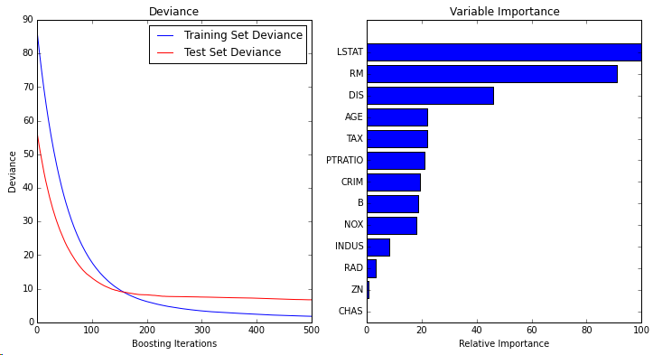

### 聚类算法

#### k-means
- 适用于球状分布
- 核心问题：初始点的选取， 𝑘值的选取，距离公式
- 优点：
	- 适用性强
	- 收敛速度快
	- 聚类结果局部最优
- 缺点：依赖参数的选取

**例子**
1.首先生成数据
``` python
import numpy as np
import matplotlib.pyplot as plt
%matplotlib inline
from sklearn.datasets.samples_generator import make_blobs
# X为样本特征，Y为样本簇类别， 共1000个样本，每个样本4个特征，共4个簇，簇中心在[-1,-1], [0,0],[1,1], [2,2]， 簇方差分别为[0.4, 0.2, 0.2]
X, y = make_blobs(n_samples=1000, n_features=2, centers=[[-1,-1], [0,0], [1,1], [2,2]], cluster_std=[0.4, 0.2, 0.2, 0.2], random_state =9)
plt.scatter(X[:, 0], X[:, 1], marker='o')
plt.show()
```
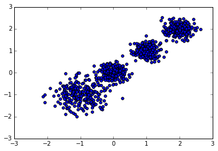
看以上数据，k=4比较合理，我们可以让k = [2,5] ，然后把使用Calinski-Harabasz Index评估的聚类分数。

``` python
from sklearn.cluster import KMeans
for index, k in enumerate((2,3,4,5)):
	plt.subplot(2,2,index+1)
	y_pred = KMeans(n_clusters=k, random_state=9).fit_predict(X)
	plt.scatter(X[:, 0], X[:, 1], c=y_pred)
	metrics.calinski_harabaz_score(X, y_pred) 
    plt.text(.99, .01, ('k=%d, score: %.2f' % (k,score)),
                 transform=plt.gca().transAxes, size=10,
                 horizontalalignment='right')
plt.show()
```
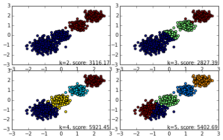


#### DBSCAN
- 关键参数：eps（给定对象半径），min_samples（邻域至少包含MinPts个样本）
- 优点：
	- 很好的抑制噪声
	- 解决非球状结构的聚类数据
	- 不需要指定聚类的个数
- 缺点：
	- 对用户定义的参数敏感（如MinPts ，Eps）
	- 全局密度参数不能刻画内在的聚类结构


**例子**
1.首先生成数据
``` python
import numpy as np
import matplotlib.pyplot as plt
from sklearn import datasets

X1, y1=datasets.make_circles(n_samples=5000, factor=.6,
                                      noise=.05)
X2, y2 = datasets.make_blobs(n_samples=1000, n_features=2, centers=[[1.2,1.2]], cluster_std=[[.1]],
               random_state=9)

X = np.concatenate((X1, X2))
plt.scatter(X[:, 0], X[:, 1], marker='o')
plt.show()
```
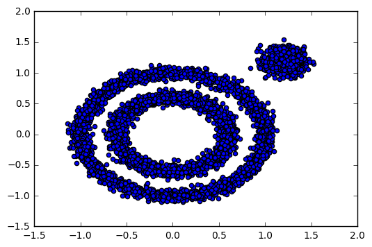

如果使用k-means来聚类，效果很不好，令k=3，聚类效果如下

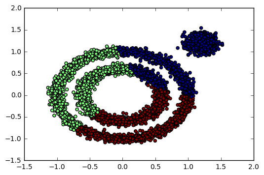
使用DBSCAN聚类

``` python
from sklearn.cluster import DBSCAN
y_pred = DBSCAN(eps = 0.1, min_samples = 10).fit_predict(X)
plt.scatter(X[:, 0], X[:, 1], c=y_pred)
plt.show()
```
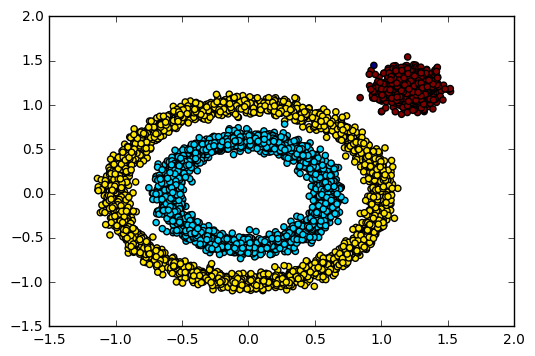

### 推荐算法
#### 协同过滤
- user-based， item-based
- 相似度计算方法：余弦相似度，欧氏距离，皮尔逊相关系数

#### 矩阵分解
https://my.oschina.net/keyven/blog/513850
https://blog.csdn.net/qq_26225295/article/details/51165858
- user-item矩阵

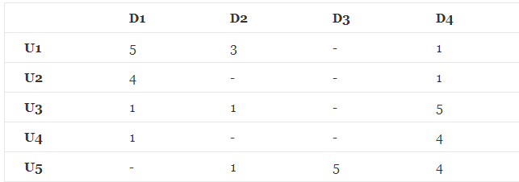

### 案例分享
团队保险的定价
业务逻辑：
询价--定价--调看sql里的数据（产品信息，保单信息，出险信息）

将连续特征归一化
保额，人数，男性占比

#### 团险定价模型
百度开发的DNN模型，基于keras开发
损失函数的选择：
- MAE与误差绝对值呈线性关系
- MSE惩罚误差较大的样本
- MSLE适合预测值范围大的样本

## 10.26
讲师：百度高级研发工程师

### 深度学习基础
**决策模型**
以评判一个人是否是一个三好学生为例，假设有三门课的成绩，三门成绩分别有不同的权值，加权成绩大于90的是三好学生。

sigmoid激活函数
	- 非线性
	- 处处可微
	- 非饱和
	- 单调递增

损失函数：交叉熵
https://blog.csdn.net/tsyccnh/article/details/79163834

**模型训练的方法**
模型根据样本数据，找出权值，然后根据调整好的权值预测新样本的lable。
softmax的作用是在网络输出端进行归一化（当处理多分类的任务时），使输出的向量之和为1，向量中max对应的标签则是预测的标签。

[反向传播](https://www.cnblogs.com/charlotte77/p/5629865.html)的作用：根据最后输入和实际情况的误差，反向传播到前面的神经层，让前面神经层的权重怎么根据误差进行调整，旨在得到最优的全局参数矩阵。

函数商的求导法则：[f(x)/g(x)]'=[f'(x)g(x)-f(x)g'(x)]/[g(x)]^2


双向RNN，t状态不仅和前面的t-1时刻有关，也和t+1时刻有关

LSTM和GRU的区别：
- GRU2个门，LSTM3个门
- GRU无状态C
- 控制方式

### 序列建模案例
#### 授信审批意见抽取
- 数据分析，字段是否适用机器学习的方法来抽取
	- 样本是否充足
	- 是否在原始文本中有标注
- 稀疏表示，分布式表示---->进一步抽象------>字粒度，词粒度
- 现在的分布式表示喜欢将词嵌入+句嵌入+谓语嵌入
- 实际问题
	- 识别脱敏实体，想法：实体是一个词，标注实体前后的词，标注字
- 模型设计
	- word embedding，bi-lstm encoder，crf layer
	- 后处理：viterbi解码，作用是降低计算复杂度
	- attention机制
	- HAN
	- self-attention，寻找序列内部的联系
	- multi-head attention
	- transformer
	- bert，transformer的再封装
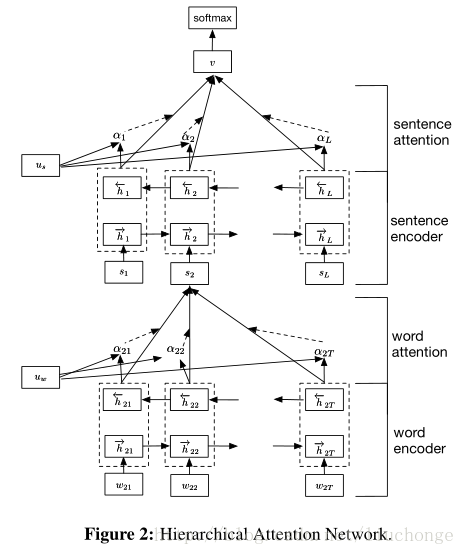


#### 提取关键词
使用attention的方法来做，引入了一个外部变量来代表全文的信息

### 人工智能平台
#### 简介
- 研发流程：数据处理---特征工程---模型训练---模型评估----模型预测
- 深度学习框架发展过程（发起于学术界，逐渐演变为巨头竞争）
	- Theano （2010）
	- Caffe（2013）
	- Tensorflow（2015）
	- MXNet（2015）
	- PaddlePaddle（2016）
	- PyTorch（2017）
	- Caffe2（2017）
#### Tensorflow
采用dataflow graph 模型表示运算关系，再将运算映射到不同的硬件进行执行。

**低级api**
tensor：变量，常量，占位，稀疏
operator：以tensor作为输入，输出的运算单元
graph：以operator为节点，以tensors输入或者输出为边
session：封装运行时状态，运行指定的operator，占用内存用于存储资源对象，调用close方法后释放
tf.device：工具函数，指定一组运算操作在特定的设备上进行
**中级api**
layer：封装变量和变量上的运算操作，如cnn中的卷积层，池化层，flatten：压平输入tensor层，如把一个2维输入变换成1维
data：提供输入数据处理pipeline的api类包
metrics：封装评估运算相关的api类包
**高级api**
estimators ，效率最高，提供模型封装，如DNN分类器，线性分类器
- 训练train
- 评估evaluate
- 预测predict
- 导出模型export_savemodel

**分布式api**
一部分负责参数更新维护，一部分负责样本计算任务，难题：worker和parameter server的通信
- cluster，计算集群，由一群job组成
- job，一组相同的任务，如worker
- task，具体执行计算任务对的服务节点

并行方案：
- 数据并行：节点并行计算各批次样本数据
- 模型并行：模型结构拆分至多节点计算

**Tensorflow架构**
https://www.jianshu.com/p/a5574ebcdeab
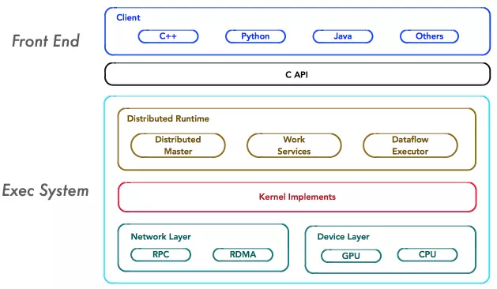

**可视化工具 TensorBoard**
能够有效地展示Tensorflow在运行过程中的计算图、各种指标随着时间的变化趋势以及训练中使用到的数据信息。
具体使用方法：https://github.com/tensorflow/tensorboard/blob/master/README.md

``` python
from tensorflow.examples.tutorials.mnist import input_data
import tensorflow as tf

mnist = input_data.read_data_sets("MNIST_data/", one_hot=True)

batch_size = 100
hidden1_nodes = 200
with tf.name_scope('Input'):  #图节点名称
    x = tf.placeholder(tf.float32,shape=(None,784))
    y = tf.placeholder(tf.float32,shape=(None,10))
with tf.name_scope('Inference'):
    w1 = tf.Variable(tf.random_normal([784,hidden1_nodes],stddev=0.1))
    w2 = tf.Variable(tf.random_normal([hidden1_nodes,10],stddev=0.1))
    b1 = tf.Variable(tf.random_normal([hidden1_nodes],stddev=0.1))
    b2 = tf.Variable(tf.random_normal([10],stddev=0.1))
    hidden = tf.nn.relu(tf.matmul(x,w1)+b1)
    y_predict = tf.nn.relu(tf.matmul(hidden,w2)+b2)

with tf.name_scope('Loss'):
    cross_entropy = tf.reduce_mean(tf.nn.softmax_cross_entropy_with_logits(labels=y, logits=y_predict))
with tf.name_scope('Train'):
    train_step = tf.train.GradientDescentOptimizer(0.5).minimize(cross_entropy)
with tf.name_scope('Accuracy'):
    correct_prediction = tf.equal(tf.argmax(y, 1), tf.argmax(y_predict, 1))
    accuracy = tf.reduce_mean(tf.cast(correct_prediction, tf.float32))


with tf.Session() as sess:
    sess.run(tf.global_variables_initializer())
    for i in range(10000):
        batch_xs, batch_ys = mnist.train.next_batch(batch_size)
        sess.run(train_step, feed_dict={x: batch_xs, y: batch_ys})
        if i%1000==0:
            print ('Phase'+str(i/1000+1)+':',sess.run(accuracy, feed_dict={x: mnist.test.images, y: mnist.test.labels}))
writer = tf.summary.FileWriter("./mnist_nn_log",sess.graph)
writer.close()
```
生成的结构图
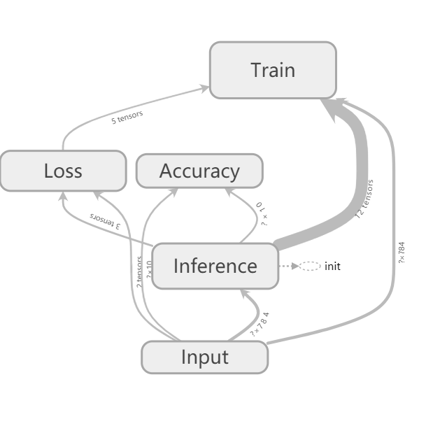

**模型预测服务 Tensorflow Serving**
模型文件：图结构，参数值，输入，输出
- 反序列化文件模型
- 加载模型
- 转发中枢，决定请求流量的分配，还有监听作用

#### Keras（太高级）
现在和TensorFlow互相融合了，tf.keras
**例子**
数据集：Fashion-MNIST
https://blog.csdn.net/LuohenYJ/article/details/81091641?utm_source=blogxgwz3

#### PaddlePaddle


## 百度一体机介绍以及应用实践
主讲人：徐东泽

docker的好处
- 与宿主机共享内核，节约资源
- 封装性
- 隔离性
- 镜像增量分发，节约带宽
- 社区活跃

docker的坏处
- 共用内核导致存在穿透问题，存在安全隐患

挂载的数据可以实时更新

deployment继承了RC的全部功能，还增加以下：
- 事件和状态查看
- 回滚与滚动升级

flannel网络


