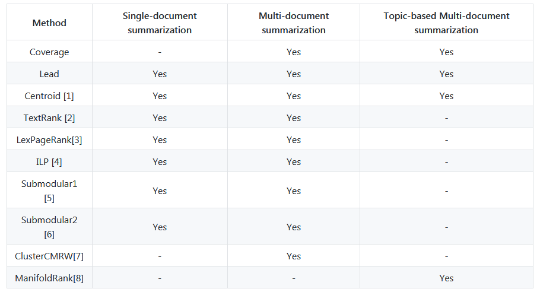

明天接着整理
https://blog.csdn.net/hohaizx/article/details/83506270

## 数据集
### 英文数据集


### 中文数据集
LCSTS  http://icrc.hitsz.edu.cn/Article/show/139.html

网友整理版本：
百度网盘：https://pan.baidu.com/s/1NWe6K33GMTp4Wk7CwaGotA
密码：4k12
在这个版本中，一共 679898 条数据，分为两个文件：
- train_text.txt	短文本的内容，约100-200字
- train_label.txt	短文本的摘要，约10-20字


## 相关论文以及项目
### 1.[Rush, 2015] A Neural Attention Model for Abstractive Sentence Summarization

这篇 facebook 的论文是用神经网络来做生成式摘要的开山之作，后续的论文基本都会引用。而且在 github 上有开源的代码放出来，地址如下：https://github.com/facebookarchive/NAMAS

### 2.[Hu 2015] LCSTS: A large scale Chinese short text summarization dataset

首先， 这篇文章的贡献在于提出了一个新的中文数据集，LCSTS，该数据集是从新浪微博中爬取过滤得到的，训练集（Part I）有 240w 对数据，验证集（Part II）有 1w，测试集（Part III）有 1k 多一点。而且验证集和测试集用人工标注了正文和标题之间的相关度（relevance），并且从 1-5 打分，分数越高越好。

### 3.[Google, 2015] Sequence-to-Sequence with Attention Model for Text Summarization

其实不是论文，而是代码，但是挺具有参考意义，包括 Attention，BeamSearch 的实现等等。项目地址如下：
https://github.com/tensorflow/models/tree/master/research/textsum


### 4.[Chopra, 2016] Abstractive sentence summarization with attentive recurrent neural networks

这篇论文是 IBM Watson 实验室的工作，针对前面的 baseline 做的改进还挺多的，主要是下面几个方面：
- 引入 Large Vocablary Trick 来解决 decoder 词表过大的问题；
- 加入传统的 TF-IDF，POS，NER 等特征来尝试抓住句子的关键部分；
- 引入 Generator-Pointer 来解决 OOV 和低频词的问题；
- 引入 Hierarchical Attention 来抓住句子的重要性信息；
- 引入 Temporal Attention 来缓解连续生成重复词的问题；
- 提出新的数据集 CNN/Daily Mail.

### 5.[See 2017] Get To The Point: Summarization with Pointer-Generator Networks

这篇 Stanford 和 Google Brain 的论文比较新，创新点在于结合了 Pointing the unknown words 和 Modeling Coverage for Neural Machine Translation 的思想，而且提出了相应的改进方案。源码使用tensorflow，地址如下：
https://github.com/abisee/pointer-generator

### 6.[Zhou 2018]Neural Document Summarization by Jointly Learning to Score and Select Sentences

句子打分和句子抽取是抽取式文摘系统的两个主要步骤，传统的方法将这两个过程独立开来，分别考虑。这篇论文中，作者提出了一个端到端（end-to-end）的神经网络框架联合学习句子打分和句子抽取。首先通过一个多层encoder得到句子表示，然后sentence extractor逐一抽取摘要句。抽取过程中，sentence extractor读入最新被抽取的句子，产生一个新的句子抽取状态，以此作为剩余句子的相对重要度得分。


## 摘要系统和工具包
### 1.genism快速实现

``` python
from gensim.summarization import summarize
sentence = "your sentence"
summarize(sentence)
```
### 2.HanLP 
- HanLP是由一系列模型与算法组成的Java工具包，目标是普及自然语言处理在生产环境中的应用。HanLP的主要功能点在于中文分词上有十分丰富的方法，并具备语料库。
- 对于自动摘要功能，HanLP较为简单，只通过TextRank进行摘要，不支持多文档摘要。用户可以直接调用`TextRankSentence.getTopSentenceList(document, size)`
- 项目地址：https://github.com/hankcs/HanLP

### 3.PKUSUMSUM
该系统是由北大万小军老师课题组制作的，集成多种无监督摘要提取算法，支持多种语言和多种摘要任务，采用Java编写，代码完全开源。集成算法一览：


项目地址：https://github.com/PKULCWM/PKUSUMSUM/blob/master/README.md

4.2.Reddit的autotldr机器人使用文本摘要来梗概从文章到帖子的各种评论。这个功能在Reddit用户中非常有名。(https://www.reddit.com/r/autotldr/comments/31b9fm/faq_autotldr_bot/)

### 4.TextTeaser
这是一个文本自动摘要API，textteaser可以自动根据全文写摘要，算法已经开源。
开源地址：https://github.com/MojoJolo/textteaser
在线实例地址：http://www.textteaser.com/
